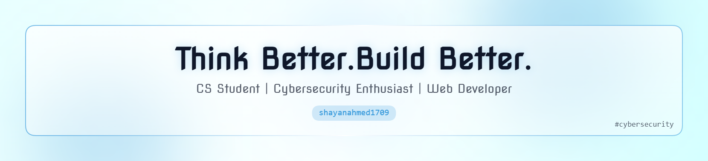

<!-- Responsive Banner -->

  <picture>
    <source media="(prefers-color-scheme: dark)" srcset="header-dark.png">
    <source media="(prefers-color-scheme: light)" srcset="header-light.png">
    
  </picture>

<!-- Title -->
<h1 align="center">Hey there, I'm Shayan 👋</h1>

<!-- Typing Animation -->

  

<!-- GitHub Badges -->

  
  
  

---

## 🌌 About Me
<table align="center">
<tr>
<td width="65%">

Hi, I'm Shayan, an independent technical consultant and creative entrepreneur.  
I transitioned from web development to reelance client support and product outreach, while exploring AI hackathons and cybersecurity fundamentals.  

🌱 Always learning, always growing.  

</td>
<td width="35%" align="center">
  
</td>
</tr>
</table>

---

## 🔭 What I'm Up To
- 🔐 Working through **CyberSavvy: Navigating Linux & Essential Cyber Security**  
- 🐧 Building my **Linux and networking fundamentals**  
- 🌐 Developing **web apps with React, Next.js, and Tailwind CSS**  
- 🎯 Aiming for a **career in cybersecurity**  

---

## 💻 Tech Stack

  

---

## 🚀 Projects Showcase

  
  
  

---

## 🎓 Certifications

  
  
  
  
  
  
  

---

## 🔥 GitHub Stats

  <!-- Streak Stats -->
  

  <!-- General Stats -->
  

  <!-- Top Languages -->
  

---

## 🐍 Contribution Snake

---

## 🌐 Connect With Me

  
  
  
  
  
  <a href="https://youtube.com/@shayan" title="Subscribe to my YouTube channel">
    <
